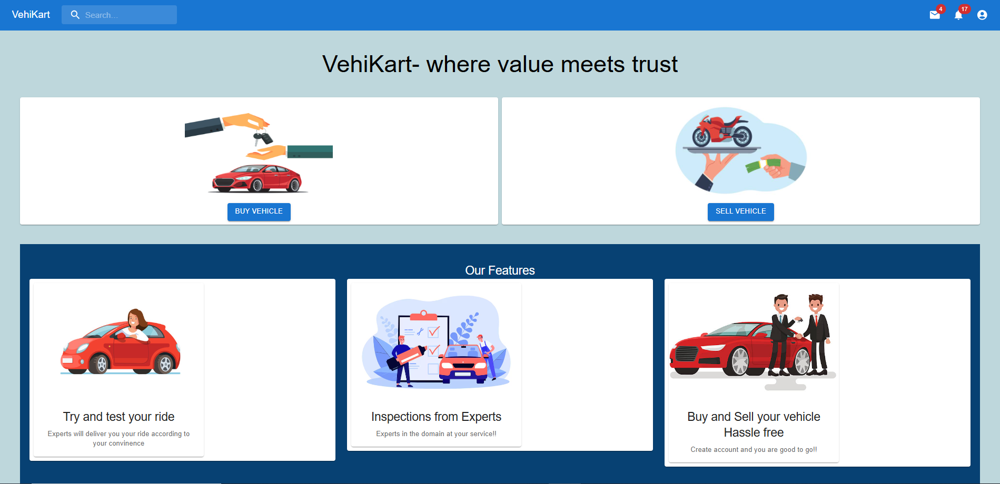
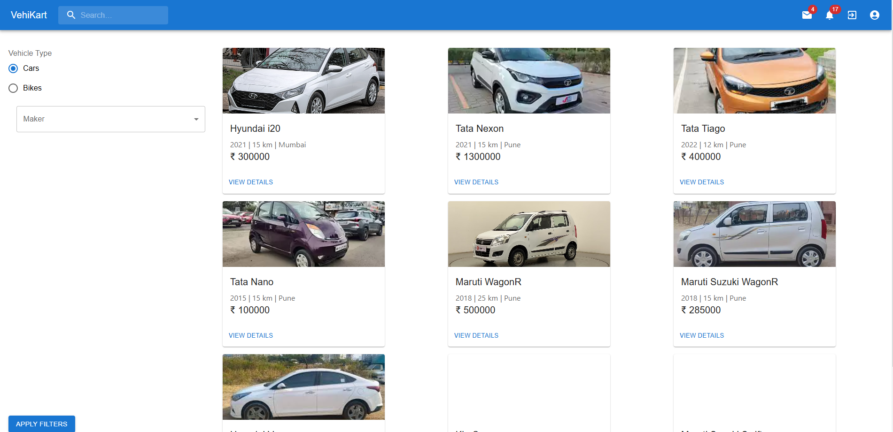
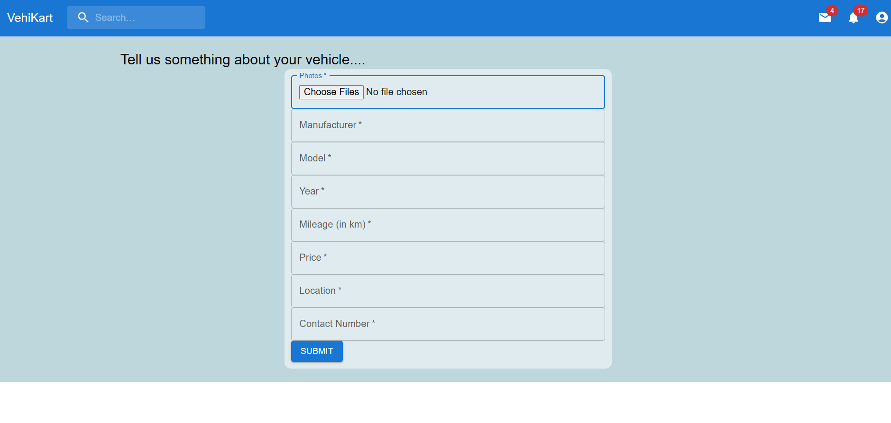
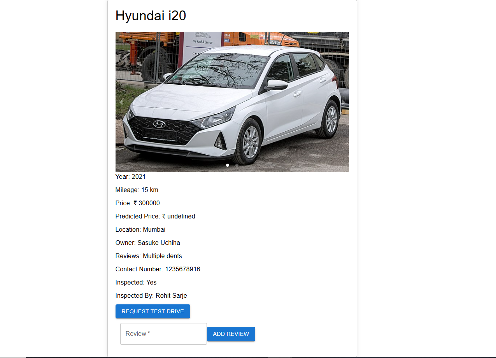

# Vehikart : Vehicle Resseling Platform

A full-stack web application for vehicle reselling that streamlines listings, management, test drive requests, and expert inspections, boosting trust and transparency in the process.


## Tech Stack

**Server:** Node JS, Express JS

**Client:** React JS, Material UI

**Database:** MongoDB


## Screenshots







## Run Locally

Clone the Project:

```bash
git clone https://github.com/rohitsarje17/VehiKart.git
```

Install Dependencies:
```bash
cd server
npm install
```
```bash
cd client
npm install
```

Start the server
```bash
cd server
npm start
```

Start the Client
```bash
cd client
npm start
```


## Authors

- [@rohitsarje](https://github.com/rohitsarje17)

